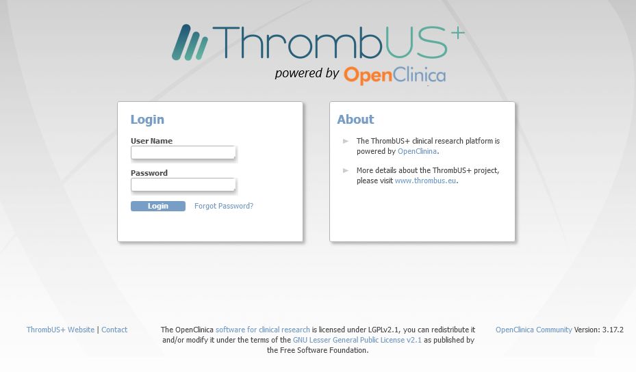
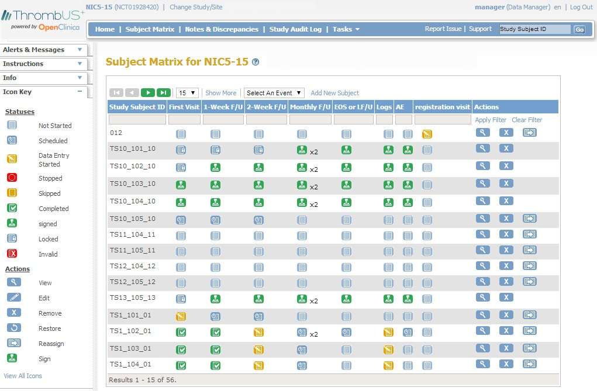

# Welcome to OpenClinica-ThrombUS project

OpenClinica is an open source software for Electronic Data Capture (EDC) and Clinical Data Management (CDM) used to optimize clinical trial workflow in a smart and secure fashion. This fork contains adaptations for the clinical studies needs of the ThrombUS+ Project (https://thrombus.eu). Use OpenClinica to:

- Build studies
- Create eCRFs
- Design rules/edit checks
- Schedule patient visits 
- Capture eCRF data from study sites via the web
- Monitor and manage clinical data
- Audit trails and electronic signatures
- Role-based access controls
- Import/Export Data
- Extract data for analysis and reporting
- and much more!

## Getting Started

- [System requirements](https://docs.openclinica.com/installation/system-requirements)
- [Release notes](https://docs.openclinica.com/release-notes)
- [Extensions/Contributions](https://community.openclinica.com/extensions)
- [Installation](https://github.com/OpenClinica/OpenClinica/wiki)

## Screenshots

## License

[GNU LGPL license](https://www.openclinica.com/lgpl-license/)
